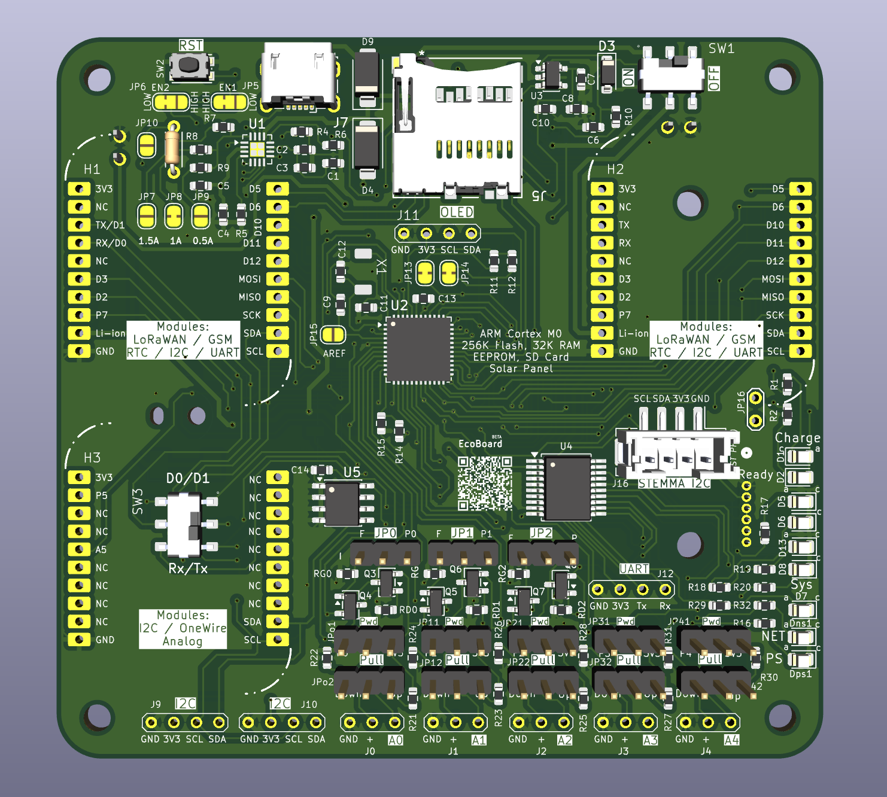
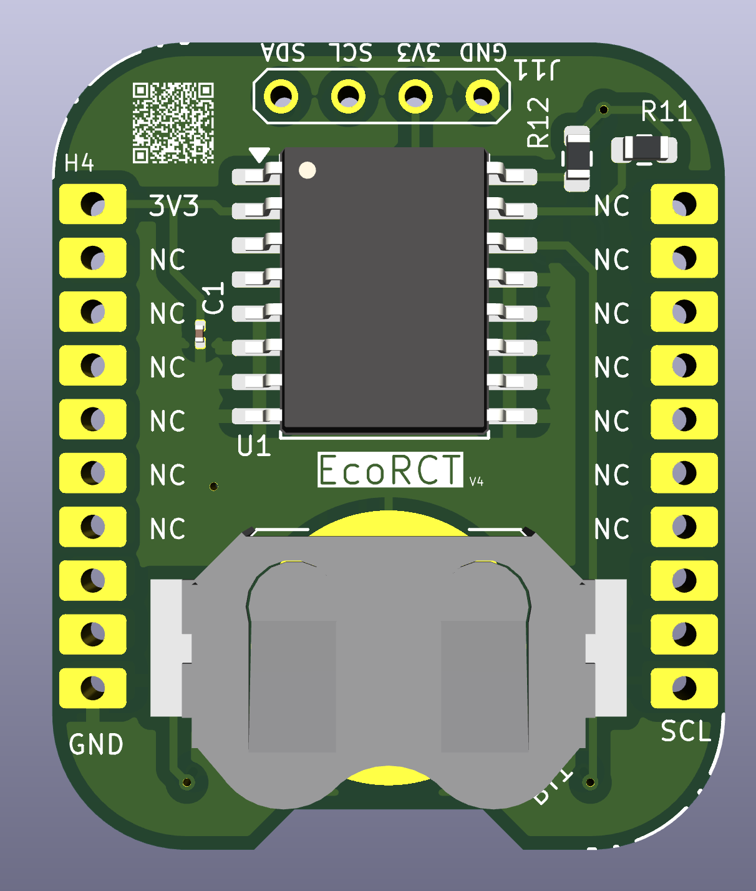
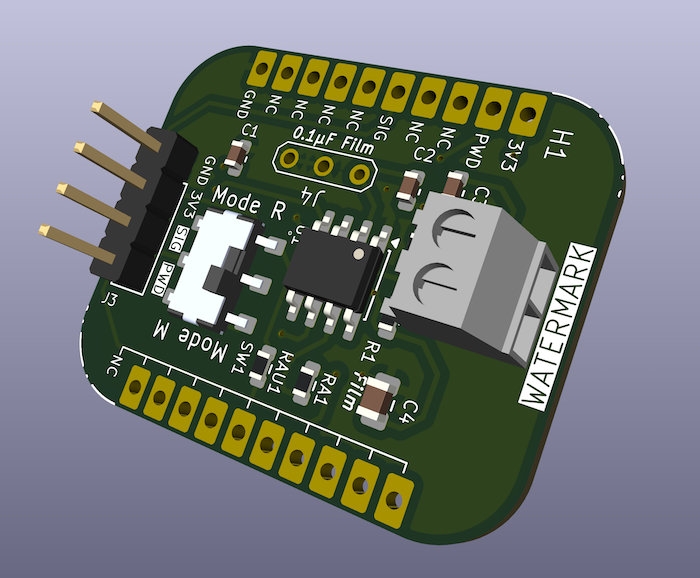
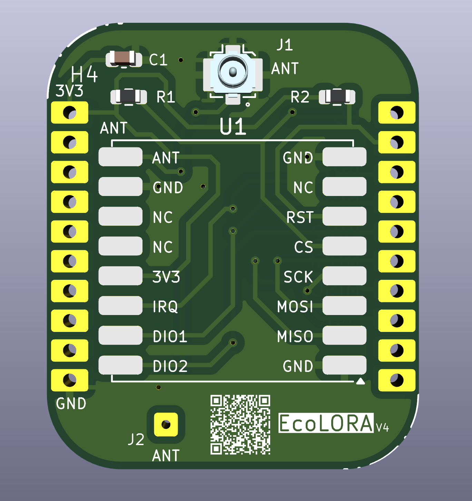
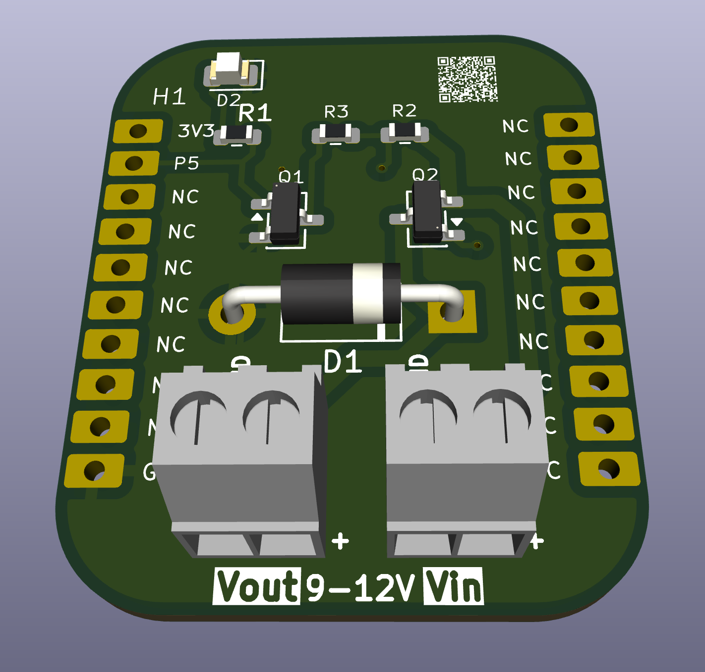
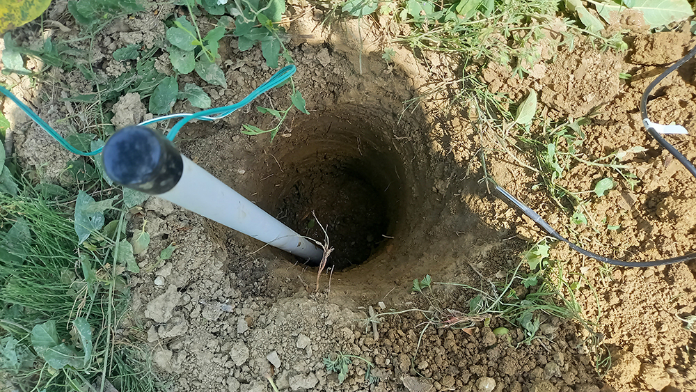
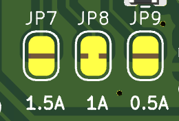
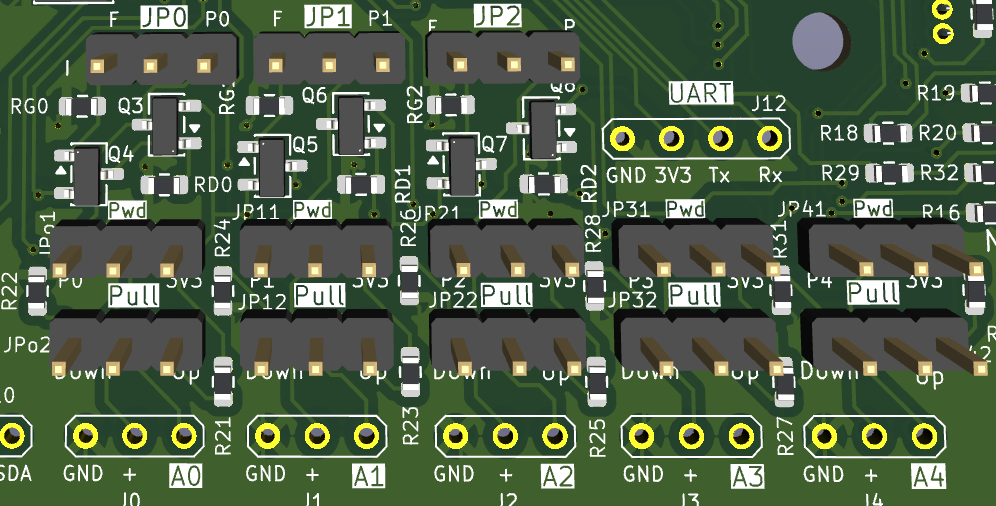

# IoT EcoBoard
(Version Beta)

> This page is been review according to the latest board version (beta).
> Feel free to check back.

EcoBord is a microcontroler based on the processor ATSAMD21G18 ARM Cortex M0 at 48Mhz with 3V3 logic, as the Arduino Zero.
The chip has **256K of FLASH and 32K of RAM**. It's fully compatible with Arduino and Adafruit libraries.

## The main board

You also connect
* **[A solar panel](https://github.com/ecosensors/EcoBoard#ecogprs-coming-soon)** input (J8 (DC Power Jack connector) and J13) to keep your board running days and nights
* An **SD Card** to log your daily events
* An **1K EEPROM** to store keys or static values
* A switch to use one or two UART (Not tested yet)
* 2 I2C headers
* 1 I2C header for a OLED
* 1 UART header
* 4 1-Wire or analog headers (A0-A4)
* 1 I2C STEMMA connector
* A reset buton
* A programable buton
* A switch ON/OFF Button

### Sensors

The board is make for serveral sensors
* a rain/gauge sensor
* a Devis Anemometer
* a Devis Pyranometer
* a barometer (Temperatore, Humidity, Pression)
* a luminosity sensor
* a IR sensor
* a OneWire sensor as a DS18B20 devise
* and any I2C, 1Wire or analog sensors

### Example of scripts
Throughout the reading, there will be a few very simple examples. At the end, there is a section with more [concrete examples](https://github.com/ecosensors/EcoBoard#examples).

## Modules
On EcoBoard, you can add different hat according to your need. Note, all modules are in Beta version

Module | Picture | Desc
--- | --- | ---
[EcoRTC](https://github.com/ecosensors/EcoBoard#ecortc) | | Use a RTC Clock module to log the events and to define precise sequences
[EcoSOIL](https://github.com/ecosensors/EcoBoard#ecosoil) |   | This module is required to measure soil moisture using a Watermark probe.
[EcoLoRA](https://github.com/ecosensors/EcoBoard#ecolora) |   | This module is required to transmit your measure with Low Range Wild Area Network (LoRaWAN RFM69/9x (868Mhz)), thereby participating in the Internet of Things (IoT)
[EcoMOSFET](https://github.com/ecosensors/EcoBoard#ecomosfet) | | This module is usefull to control an external devise as a 9-12V soleniod valve 
EcoI2C | Coming soon|
[EcoGPRS](https://github.com/ecosensors/EcoBoard#ecogprs) | Coming soon | For the moment, a SIM808 hat, from Adafruit, can be connected, bellow the main board.
 

### EcoLORA

You can connect the EcoLORA module built with a RFM95 [LoRaWWAN](https://en.wikipedia.org/wiki/LoRa#LoRaWAN) radio module for Europe (868Mhz).

For now, you have an example with a Raspberry, Python and TTN [here](https://github.com/ecosensors/ecoradio#rfm95-radio-lorawan)

### EcoSOIL

This module has been build to use a Watermark sensor.

Watermark sensors are tensiometric probes that allow for the calculation of soil water content in kPa. In other words, the suction force that roots must exert to extract water from the soil.

 

Form now, I recommand to connect the module (or several modules) to J0, J1 or J2, until I test it on the Header H4

The Watermark probe must not be powered continuously. It must be powered for 20 seconds before the measurement and then deactivated. That the reason why, you need to have PWD pin HIGHT 20sec before taking a measure, and then PWD must be LOW.

#### Switch

The module contain an LMC555 IC.

Mode | Action | Comment
--- | --- | ---
R | The LMC555 IC is powered with the VCC pin from the 3V3. The probe is activate with EN pin (LMC555) while PWD is HIGH | Recommanded
M | While PWD is HIGH, the pin EN and VCC are HIGH. Otherwise the probe is inactived. | Slightly reduced consumption

#### Header J2

You can connect the Watermark probe

#### Header J3

PIN | Out
--- | ---
1 | GND
2 | 3V3
3 | Signal
4 | PWD

The Signal (3) return a frequency output.

> The Shock equation allows the calculation of soil water potential (SWP, in kPa or cbar) from the electrical resistance of the Watermark sensor (in kOhms) and the soil temperature (in °C).

### EcoRTC
If you need to log any events according to the time, or if you wish to trigger your sensor measurements according to a precise sequence, you can use that module on one of the socket H1, H2 or H3

Some exmaple scripts are available, [at the bottom](https://github.com/ecosensors/EcoBoard#examples)

### EcoMOSFET

The EcoMOSFET has been built to connect a 9-12V soleniod valve. While P5 is HIGHT, the soleniod valve is powered by a external 9-12V battery and the water flows when the Watermark probe detects sil that is too dry. While P5 is LOW, the soleniod valve closes and the water stops flowing.

You can control another devise as long as the voltage is not higher than 12V.

Example will come late.

### EcoGPRS 
For now, the module is not available yet, but you can connect [a SIM808 board from Adafruit](https://www.adafruit.com/product/2691), bellow the board (J14).
This option has not been tested, and the plan is to remove J14 to create a module for H1 or H2.

## Solar panel
The EcoBoard is built with a BQ24074 to keep your Lithium Ion (LiIon) rechargeable batteries topped up. You can use USB, DC or Solar power, with a wide 5-10V input voltage range. The charger chip is super smart, and will reduce the current draw if the input voltage starts to dip under 4.5V, making it a perfect near-MPPT solar charger that you can use with a wide range of 5-10V panels.

The bq24074 which powers this design is great for solar charging, and will automatically draw the most current possible from the panel in any light condition Even thought it isn't a 'true' MPPT (max power point tracker), it has near-identical performance without the additional cost of a buck-converter.

### Features

* 3.7V/4.2V Lithium Ion or Lithium Polymer battery charger
* Charge with 5-10V DC, USB or 5-10V solar panel
* Use any 5-10V solar panel
* Two color indicator LEDs (D1 and D2)
* Set for 1000mA max charge rate, can be adjusted to 500mA or 1.5A by soldering closed a jumper '0.5A' or '1.5A' (do not forget to cut the jumper '1A').
* automatically uses the input power when available, to keep battery from constantly charging/discharging
* Optional Temperature monitoring of battery by soldering in a 10K NTC thermistor (not included) at J10
* Input current limit configuration

### Charge rate

The default charge rate is 1A. To modify from the default value, cut the traces in the jumpers and solder according to your need (JP7, JP8, JP9).

### Input current limit

To modify from the default, cut the traces in the jumpers and solder according to the options below

100 mA input current limit 
Jumper | Status
--- | ---
EN1 | LOW
EN2 | LOW

500 mA input current limit (Default)
Jumper | Status
--- | ---
EN1 | HIGH
EN2 | LOW

1.5A input current limit (Should not be used)
Jumper | Status
--- | ---
EN1 | LOW
EN2 | HIGH

## EEPROM
EcoLora has a 1KB EEPROM  (74LC01) to store relatively small amounts of data as keys or parameters

See simple example [here](https://github.com/ecosensors/EcoBoard/tree/master/examples/02_eeprom)

## SD Card

We add an SD card to log the activities or to save some parameters or other values. The MicroSD card is not provided with the board.
You can use the board without the SD card.

## Pinout

### UART (Serial)
**J12**

Pin | Out
--- | ---
1 | GND
2 | 3V3
3 | Tx
4 | Rx

**H1**

UART is available on H1 on PIN 3 (Tx) and 4 (Rx). Do not use two UART devises at the same time, exepted if you switched SW3 (not tested yet).

**H2**

UART is available on H1 on PIN 3 (Tx) and 4 (Rx). Do not use two UART devises at the same time.

**SW3**

If you move the switch SW3 to Do/D1, H1 will consider the pin Do and D1 of the ATSAMD21G18 for a second UART or to use D0 and D1 as a digit pin.
> Thta option has not been tested yet.

### I2C

Header | Description
--- | ---
J10, J9 | You can connect any I2C sensors
J11 (OLED) | Even though you may use any I2C sensors, that header is mainly used for a small OLED board.
J16 | You can solder an JST connector (B4B-PH-SM4-TB 2mm). Be aware the SDA and SCL pin are not in the same order than the other I2C headers. That header has been mainly integrated to use OLED with s STEMMA connector from Adafruit. 

### Analog or 1 Wire

Headers | Description
--- | ---
J0, J1, J2, J3, J4 | An analog sensors whose reading is taken on A0, A1, A2, A3 or A4

Jumpers | Description
--- | ---
JP02, JP12, JP22, JP32, JP42 | To pull Up/Down A0, A1, A2, A3, A4  
JP01, JP11, JP21, JP31, JP41 | To power continuously the sensor with 3V3 or to trigger it with P0 (MCP230008)
JP0, JP1, JP2 | Only for A0, A1 and A2. To trigger the sensor with P4 or through a MOSFET (see bellow). It has no effect if the sensor is powered continuously with 3V3. 

To better understand how it works, here is an example if you connect a sensor on A0.

**Jumper JP0**

> J0 has no effect if JP01 is on 2-3 position (powered continuously with 3V3)

> Only for A0, A1, and A2

According to the Microchip MCP23008 Datasheet,  the absolute maximum current output (source or sink) for the P0 pin (labeled as GP0) is 25 mA. If for some reasons, you sensor need more than 25mA, you can move the jumper to 1-2.

Jumper | Trigger
--- | ---
1-2 [F] | P0 trigger the sensor through the MOSFET (max 500mA)
2-3 [P0] (default) | P0 ignore the MOSFET (max 25mA)

**Jumper JP01**

The sensor can be powered continuously with 3V3 or you can trigger it with P0 (MCP230008).

Jumper | Power
--- | ---
1-2 | The sensor is triggered while P0 is HIGH
2-3 | powered continuously with 3V3

**Jumper JP02**

Jumper | Pull the sensor output
--- | ---
1-2 | Pull Down A0
2-3 | PUll Up A0
Removed | no pull up/down

**Header J0**

Pin | Out
--- | ---
1 | GND
2 | Power
3 | A0

## Other headers
Read [Analog or 1 Wire](https://github.com/ecosensors/EcoBoard#analog-or-1-wire) section, as well

### Header H1 and H2 (with EcoLORA or EcoGPRS)

Pin | ATSAMD21G18 (GPIO) | EcoLora | EcoGprs** 
--- | --- | --- | --- 
1 | 3V3 | 3V3 | 3V3  
2 | NC | NC | NC (VIO (Bridged with 3V3)) 
3 | Tx (D1*) | NC | Rx
4 | Rx (D0*) | NC | Tx
5 | NC | RST | NC
6 | D3 | NC | Key
7 | D2 | NC | RI
8 | P7 | NC | RST
9 | Li-ion | NC | BAT
10 | GND | GND | GND
11 | SCL | NC | NC
12 | SDA | NC | NC
13 | SCK | SCK | NC
14 | MISO | MISO | NC
15 | MOSI | MOSI | NC
16 | D12 | DIO2 | NC
17 | D11 | DIO1 | NC
18 | D10 | IRQ | NC
19 | D6 | RST | NC
20 | D5 | CS | NC

\* Only for H1, While SW3 is on DO/D1 position

** Not tested yet

### Header H3

Pin | ATSAMD21G18
--- | --- 
1 | 3V3
2 | P5
3 | NC
4 | NC
5 | A5
6 | NC
7 | NC
8 | NC
9 | NC
10 | GND
11 | SCL
12 | SDA
13 | NC
14 | NC
15 | NC
16 | NC
17 | NC
18 | NC
19 | NC
20 | NC

### Header X1 (MicroUSB)

Pin | Output
--- | ---
1 | VBUS
2 | D-
3 | D+
4 | NC
5 | GND

### Header J15 (JST 3.7V Lithium Battery)

Pin | Output
--- | ---
1 | GND
2 | VBAT

### Byttery holder BT1 (18650)

Pin | Output
--- | ---
1 | GND
2 | VBAT

### Header J6 (MicroUSB)

Pin | Output
--- | ---
1 | VUSB
2 | D-
3 | D+
4 | NC
5 | GND

### Header J6 (debuger/programmer)
I only use it to upload the firmware.

Pin | Output
--- | ---
1 | GND
2 | 3V3
3 | SWCLK
4 | SWDIO
5 | !RESET (You need to close JP16)
6 | NC

## Jumpers

Read [Analog or 1 Wire](https://github.com/ecosensors/EcoBoard#analog-or-1-wire) section, as well

### JP15 (AREF)
Close is to connect HREF to 3V3
(Default: open)
 

### JP14 (SDA)
Connected to a 4.7kOhm pull-up resistance.
Default: Close
Cut the trace if you does not want to pullup the SDA

### JP13 (SCL)
Connected to a 4.7kOhm pull-up resistance.
Default: Close
Cut the trace if you does not want to pullup the SCL

### JP16
Open by default. Solder to close the JP16 to connect the pin 5 of J6 (debuger/programmer) to RESET

### JP10 (THERM Jumper)

(Default: open) Solder it if you want to connect a Thermistor at R3

### EN1 & EN2
See at the solar panel section

## LEDs

### D2
Battery is charged

### D1
Charging

### D8 (white) and 13 (red)
The LED D8 and D13 are connected to D8 and D13 of the ATSAMD21G18
(D13 light on when you upload the code)

### D5 (white) and D6 (blue)
The LEDs D5 and D6 can be powered with P5 and P6 of the MCP23008

## Examples

Actually, I have some [examples](https://github.com/ecosensors/EcoBoard/tree/master/examples) scipts for the EcoBoard
* How to work with the EEPROM
* How to use the GPIO I/O expander port and a 1-Wire Digital temperature sensor (DS18B20)
* How to use a barometer (BME280)
* How to use a Davis anemometer
* How to log data into a SD card

For all example scripts, **feel free to collaborate and share suggestions for improvement** :)

For all example scripts, **feel free to collaborate and share suggestions for improvement** :)

More example scripts for all modules and sensors will be available for you, in the near future.

* a pyranometer
* a rain gauge
* a drop counter for watering crops
* a Waternark sensors to better plan crop irrigation
* LoRaWANN
* EEPROM
* SD Card
* Etc

## License
EcoBoard © 2024 by Pierre Amey is licensed under CC BY-NC-SA 4.0
