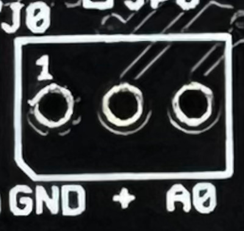

# EcoBoard

***The following page is being writting***


EcoBord V3 is a new microcontroler based on the processor ATSAMD21G18 ARM Cortex M0 at 48Mhz with 3V3 logic, as the Arduino Zero.
The chip has **256K of FLASH and 32K of RAM**. It's fully compatible with Arduino and Adafruit libraries.

We add several useful features
* LoRaWAN RFM69/9x (868Mhz) module (Option)
* GSM/GPS (SIM808) module (option)
* Solar panel input
* 1Kb EEPROM
* A MicroSD card
* A Real Time Clock (Option)
* GPIO Port Expander
* 2 I2C connector
* 1 UART connector
* 5 1-Wire or Analog connector 
* A debuger/programmer connector
* A reset buton
* A programable buton
* A switch ON/OFF Button


## Pictures


## Examples
I provide some [examples](https://github.com/ecosensors/EcoBoard/tree/master/examples) to quickly start with the EcoBoard. All examples are done for the EcoBoard, but you can easly use it for other Arduino board, with may be, a few modification as the pin definition. Note, the examples are basic and you will probabely improve it for your application. Feel you free to propose correction or improvement, scpecialy if you noticed some errors, or a better way to do. (More examples will be added soon)

## LoRaWAN or GPRS/GPS
### LoRaWAN
You can connect the EcoLora V3 borad built with a RFM95 [LoRaWWAN](https://en.wikipedia.org/wiki/LoRa#LoRaWAN) radio module for Europe (868Mhz).

Example will come later for Arduino

For now, you have an example with a Raspberry, Python and TTN [here](https://github.com/ecosensors/ecoradio#rfm95-radio-lorawan)

### GPRS/GPS
The same connector is foresee to have a GPRS/GPS module (SIM808), but this option is still under developpement

## Solar panel
The EcoBoard is built with a BQ24074 to keep your Lithium Ion (LiIon) rechargeable batteries topped up. You can use USB, DC or Solar power, with a wide 5-10V input voltage range. The charger chip is super smart, and will reduce the current draw if the input voltage starts to dip under 4.5V, making it a perfect near-MPPT solar charger that you can use with a wide range of 5-10V panels.

The bq24074 which powers this design is great for solar charging, and will automatically draw the most current possible from the panel in any light condition Even thought it isn't a 'true' MPPT (max power point tracker), it has near-identical performance without the additional cost of a buck-converter.

### Features

* 3.7V/4.2V Lithium Ion or Lithium Polymer battery charger
* Charge with 5-10V DC, USB or 5-10V solar panel
* Use any 5-10V solar panel
* Two color indicator LEDs (D1 and D2)
* Set for 1000mA max charge rate, can be adjusted to 500mA or 1.5A by soldering closed a jumper '0.5A' or '1.5A' (do not forget to cut the jumper '1A').
* automatically uses the input power when available, to keep battery from constantly charging/discharging
* Optional Temperature monitoring of battery by soldering in a 10K NTC thermistor (not included) at J10
* Input current limit configuration


### Charge rate


The default charge rate is 1A. To modify from the default value, cut the traces in the jumpers and solder according to your need.

### Input current limit


To modify from the default, cut the traces in the jumpers and solder according to the options below

100 mA input current limit 
Jumper | Status
--- | ---
EN1 | LOW
EN2 | LOW

500 mA input current limit
Jumper | Status
--- | ---
EN1 | HIGH
EN2 | LOW

1.5A input current limit (Default)
Jumper | Status
--- | ---
EN1 | LOW
EN2 | HIGH


## EEPROM
EcoLora has a 1KB EEPROM  (74LC01) to store relatively small amounts of data as keys or parameters.

See simple example [here](https://github.com/ecosensors/EcoBoard/tree/master/examples/eeprom)

## SD Card

We add an SD card to log the activities or to save some parameters or other values. The MicroSD card is not provided with the board

See a SD example with [bme280](https://github.com/ecosensors/EcoBoard/tree/main/examples/sd-bme280)


## GPIO I/O expander port (PCF8574)
EcoBoard uses 6 additonal GPIO with the PCF8574 ([Datasheeet](https://www.ti.com/product/PCF8574) ). The outputs P1 to P6, controls other devices or LEDs. However, as the outputs can only provide 25mA, in some cases, this power may not be sufficient. It's the reason why, we added three MOSFET-P (IRML2244) on the outputs P0, P1, P2 and P3. 


Thus, the outputs P0, P1, P2 and P3 will colse/open the MOSFET-P to power the devises connected at J0 to J3 with VCC (max 500mA) instead of the PCF8574 output. (Read Headers section).

Jumper | Devise | Status
--- | --- | ---
P0 * | Power the devise on J0 (max 500mA) | LOW to turn on the sensor
P1 * | Power the devise on J1 (max 500mA) | LOW to turn on the sensor
P2 * | Power the devise on J2 (max 500mA) | LOW to turn on the sensor
P3 * | Power the devise on J3 (max 500mA) | LOW to turn on the sensor 
P4 | Power the devise on J4 (Max 25mA| HIGH to turn on the sensor
P5 | LED D5 | HIGH to turn on the LED (max 25mA)
P6 | LED D6 | HIGH to turn on the LED (max 25mA)

### IMPORTANT

The jumpers ARE NOT SOLDERED. You have to solder the jumpers, either to Px or 3V3

All devices connected to 1 to 4 can be permanently powered with VCC by changing the jumper JP_1 to JP_4


See an exemple about PCF9574 and 1-Wire sensor [here](https://github.com/ecosensors/EcoBoard/tree/master/examples/expander-1wire)

## Pinout

### Header J0 to J5



All of those connectors are Analogic inputs, but you also can use a 1-Wire sensors.


By default, the input are not wired to a 4.7kOhm. However, You can choose to pull up or pull down (4.7kOhm) the input by soldering the jumpers JP0 to JP5

### Header J0 to J4

As I mentionned above, you need to solder the jumper JP_1 to JP_4 to choose wither if you will permanently power the sensors or if you want to manage the power state through a MOSFSET-P and the PCF8574.


If you want to permaently power the sensor, change the Jumper JP_0, JP_1, JP_2, JP_3 or JP_4 to '3V3'
If you want to manager the power the sensor, change the Jumper JP_0, JP_1, JP_2, JP_3 or JP_4 to P1, P2, P3 or P4.
**Do not leave JP_0, JP_1, JP_2, JP_3 or JP_4 open**

Change P0, P1, P2, P3 or P4 to LOW state to power the sensor and HIGH to unpower the sensor. 
(Note: as the maximum output current of the PCF8574 is 25 mA per pin, we use a MISFET-P to power the sensor with 3V3 (max 500mA)


### Header J0

Pin | Output
--- | ---
1 | GND
2 | P0 or 3V3
3 | A0 

### Header J1

Pin | Output
--- | ---
1 | GND
2 | P1 or 3V3
3 | A2 

### Header J2

Pin | Output
--- | ---
1 | GND
2 | P2 or 3V3
3 | A2 

### Header J3

Pin | Output
--- | ---
1 | GND
2 | P3 or 3V3
3 | A3 

### Header J4

Pin | Output
--- | ---
1 | GND
2 | P4
3 | A4

### Header J5 (UART)

Pin | Output
--- | ---
1 | GND
2 | 3V3
3 | Rx (D0)
4 | Tx (D1)

### Header J6 (I2C)

Pin | Output
--- | ---
1 | GND
2 | 3V3
3 | SCL
4 | SDA

See an example with [bme280](https://github.com/ecosensors/EcoBoard/tree/main/examples/sd-bme280)

### Header J7 (I2C)

Pin | Output
--- | ---
1 | GND
2 | 3V3
3 | SCL
4 | SDA

See an example with [bme280](https://github.com/ecosensors/EcoBoard/tree/main/examples/sd-bme280)


### Header J8 (Solar input)

Pin | Output
--- | ---
1 | GND
2 | POWER


### Header J9 (EcoLora V3 input)


At J9, you can use and connect the EcoLora V3 board. The GSM board is not ready yet.
The ATSAMD21G18 column indicates the connection to the µController. 


Pin | LoRaWAN | GSM | ATSAMD21G18
--- | --- | -- | --
1 | 3V3 | 3V3 | 
2 | NC | VIO | 
3 | NC | Rx | 
4 | NC | Tx | 
5 | RST | NC | D6 (D29)
6 | NC | NC | 
7 | NC | NC | 
8 | NC | NC | 
9 | NC | NC | 
10 | GND | GND | 
11 | MISO | NC | (19)
12 | NC | NC | 
13 | SCK | NC | (20)
14 | NC | NC | 
15 | IRQ | RST | D10 (27)
16 | NC | NC | 
17 | MOSI | NC | (21)
18 | DIO_2 | KEY | D12 (28)
19 | DIO_1 | RI | D11 (25)
20 | CS | NC | D5 (24)

### Header J10 (NTC)
Connects the thermistor input to ground when not in use. To use a thermistor, carefully cut the THERM jumper connection and connect a 10kΩ NTC thermistor in the battery pack to the THERM pin. The thermistor should also be connected to the negative lead of the battery pack.


Pin | Output
--- | ---
1 | GND
2 | NTC


### Header X1 (MicroUSB)

Pin | Output
--- | ---
1 | VBUS
2 | D-
3 | D+
4 | NC
5 | GND

### Header J11 (JST 3.7V Lithium Battery)

Pin | Output
--- | ---
- | GND
+ | VBAT

### Byttery holder BT1 (18650)

Pin | Output
--- | ---
- | GND
+ | VBAT


### Header J12 (MicroUSB)

Pin | Output
--- | ---
1 | VUSB
2 | D-
3 | D+
4 | NC
5 | GND

### Header J13 (debuger/programmer)
Power Output for the irrigation board

Pin | Output
--- | ---
1 | GND
2 | 3V3
3 | SWCLK
4 | SWDIO
5 | !RESET (You need to close JP9)
6 | NC

### Header J14 (debuger/programmer)

Pin | Output
--- | ---
1 | GND
2 | 3V3
3 | SWCLK
4 | SWDIO

### Header J15

Pin | Output
--- | ---
1 | GND
2 | VBUS

## Jumpers

### JP0 thus JP4


By default, the analog input are not wired to a 4.7kOhm (pullup/pulldown). However, You can choose to pull up or pull down (4.7kOhm) the input by soldering the jumpers JP0 to JP5, on A0, A1, A2, A3, or A4
(Default: all open)


### JP_0 thus JP_4


All devices connected to 1 to 4 can be permanently powered with VCC by changing the jumper JP_1 to JP_4
The jumpers ARE NOT SOLDERED. You have to solder the jumpers, either to Px or 3V3

You can also read the section [GPIO I/O expander port (PCF8574)](https://github.com/ecosensors/EcoBoard/tree/master?tab=readme-ov-file#gpio-io-expander-port-pcf8574-and-1-wire)


### JP5 (AREF)
Close is to connect HREF to 3V3
(Default: open)
 


### JP7 (SDA)
Connected to a 4.7kOhm pull-up resistance.
Default: Close
Cut the trace if you does not want to pullup the SDA

### JP8 (SCL)
Connected to a 4.7kOhm pull-up resistance.
Default: Close
Cut the trace if you does not want to pullup the SCL

### JP9
Open by default. Solder to close the JP9 to connect the pin 5 of J13 (debuger/programmer) to RESET


### JP10
Open by default. You can choose to power your application either from the Liothium battery (I rather prefere) or from the Output of the BQ24074


### THERM Jumper

(Default: close) Cut it if you want to connect a Thermistor at J10

### EN1 & EN2
See at the solar panel section

### '0.5A', '1A', '1.5A'
See at the solar panel section


## LEDs

### D1
Battery good

### D2
Charging

### D8 (green) and 13 (red)
The LED D8 and D13 are connected to D8 and D13 of the ATSAMD21G18
(D13 light on when you upload the code)


### D5 (white) and D6 (blue)
The LEDs D5 and D6 can be powered with P5 and P6 of the PCF8574

Here a basic example:

```
#include <Wire.h>                   // Required for I2C communication
#include "PCF8574.h"                // Required for PCF857
PCF8574 expander;                   // Required for PCF857

void setup(){
  Serial.begin(9600);
  Serial.println("Starting with PCF8574");
  expander.begin(0x27);           // Define the I2C address
  expander.pinMode(5,OUTPUT);
  expander.pinMode(6,OUTPUT);
}

void loop() {
  Serial.println("TESTING THE LEDs (P5 and P6)");
  Serial.println("Turn on LED 5");
  expander.digitalWrite(5, HIGH);
  delay(1000);
  Serial.println("Turn off LED 5");
  expander.digitalWrite(5, LOW);
  delay(1000);
  Serial.println("Turn on LED 6");
  expander.digitalWrite(6, HIGH);
  delay(1000);
  Serial.println("Turn off LED 6");
  expander.digitalWrite(6, LOW);
  delay(1000);
  Serial.println("");
 ```
 
A detailed example can be found here [expander-1wire](https://github.com/ecosensors/EcoBoard/tree/master/examples/expander-1wire)

## Showcases

Actually, I have some example code for the EcoBoard
* How to work with the [EEPROM](https://github.com/ecosensors/EcoBoard/tree/master/examples/eeprom)
* How to use [the GPIO I/O expander port and a 1Wire sensor](https://github.com/ecosensors/EcoBoard/tree/master/examples/expander-1wire) (DS19B20)
* How to use [a barometer (BME280) and the SD card](https://github.com/ecosensors/EcoBoard/tree/master/examples/sd-bme280)

In the very near future, I will provide example codes to use

* A anenometer (you already have a very close example [here](https://github.com/ecosensors/EcoAnemo))
* A Piranometer
* A rain gauge
* A drop counter for watering crops
* A waterproof DS18B20 Digital temperature sensor
* A barometer
* A Waternark sensors to better plan crop irrigation

## License
EcoBoard © 2022 by Pierre Amey is licensed under CC BY-NC-SA 4.0
