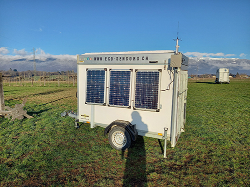

# Examples
## Why
My aim is to bring together 6 years of work on my various embedded system projects on a board and to provide various simple examples to learn how to develop with Arduino based on my own developpement board EcoBoard v3. 

My goal is to write/improve/adjust all of the provided examples for student projects or education purpose.

I do this work in my spare time and as a hobby.

The developpement of the exercices are in progress. For now, all exercises preceded by a number (0x_name) are ready.

All examples are distributed WITHOUT WARRANTY!

## In progress
* rtc-sd-bme280

## Next
* Play with LEDs and monitor LiPO Battery of the board 
* Rain gauge / Watering drop sensors
* Pyranometer sensor
* Sending data over a LoRaWAN Gateway

*LoRaWAN Gateway powered with solar panels*

* All in one exercice!!
* WATERMARK sensors ([Irrigation of the soil crops](https://eco-sensors.ch/smart-irrigation/))
* Developping the GPRS/GPS PCB board to be used with the EcoBoard v3

## License
EcoBoard © 2024 by Pierre Amey is licensed under CC BY-NC-SA 4.0

