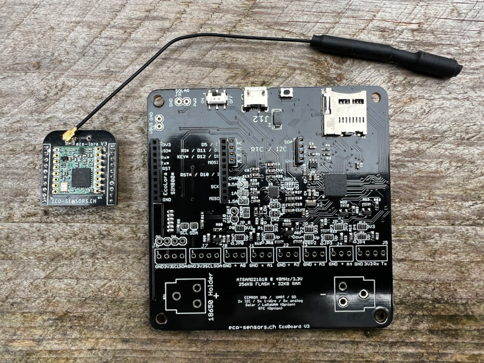

# Examples
## Why
My aim is to bring together 6 years of work on my various embedded system projects on a board and to provide various simple examples to learn how to develop with Arduino based on my own board EcoBoard v3.

I do this work in my spare time and as a hobby.

The developpement of the exercice are in progress. For now, all exercises preceded by a number (0x_name) are ready.

All examples are distributed WITHOUT WARRANTY!

## In progress
* rtc-sd-bme280

## Next
* Play wuth LEDs
* Rain gauge
* Pyranometer
* Sending data over a LoRaWAN soalr Gateway

* Developping the GPRS/GPS PCB board

